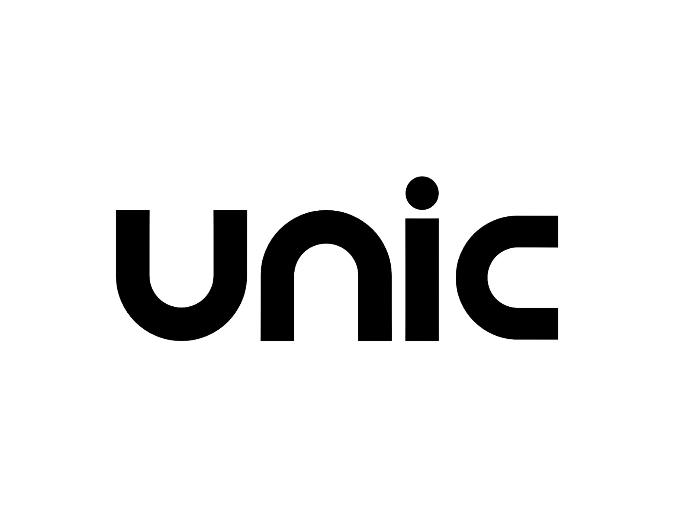

## Unic Framework

<p align="center">
  
</p>

Unic is a high performance, open source web application framework.
Unic framework is fast, minimal and unopinionated web framework inspired by express.

## User Guide

- [Installation](Installation.md)
- [Routing](Routing.md)
- [Middlewares](Middlewares.md)
- [Static files](Static-files.md)
- [File Uploading](File-Uploading.md)
- [Session](Session.md)
- [Cookie](Cookie.md)
- [Request](Request.md)
- [Response](Response.md)

## Simple Example

  A simple `Hello, World` web application in unic framework.

```php
use Unic\App;

$app = new App();

$app->get('/', function($req, $res, $next) {
  $res->send("Hello, World!");
});

$app->start();
```

## License

  [MIT License](https://github.com/unicframework/unic/blob/main/LICENSE)
